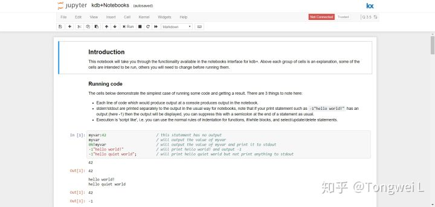
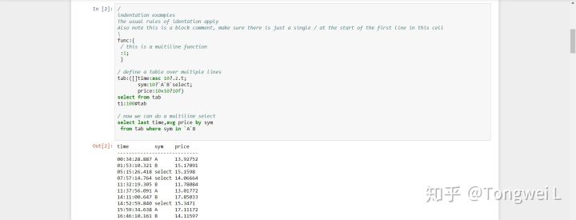
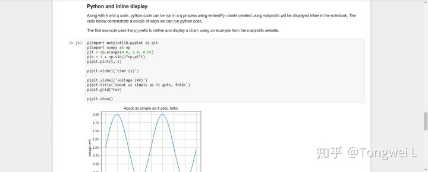

## Docker安装
安装好Docker后，pull个镜像：
```
docker run -it -p 8888:8888 --name myjupyterq kxsys/jupyterq
```
过程中会需要输入邮箱来验证授权许可，然后访问 http://localhost:8888/notebooks/kdb%2BNotebooks.ipynb 就可以了。

之后输入下列命令行可以再次启动docker容器，无需再进行license授权许可:
```
docker start -ai myjupyterq
```
jupyter运行起来就下面这样：





还是需要再好好学习，提高下研究姿势。

Q的学习小教程再Tuturialspoint上有
[KDB+ Tutorial](https://www.tutorialspoint.com/kdbplus/index.htm)

## 参考网站
[磨人的KDB+](https://zhuanlan.zhihu.com/c_175078307)

## 单独学，专注学 也得3个月的时间，应用就好
