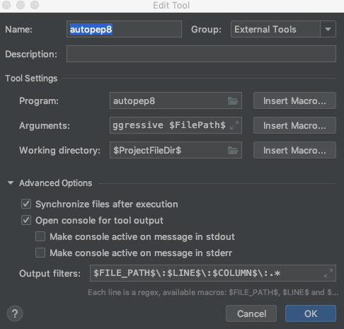

## pep8 编码规范
```
name : autopep8

Program : autopep8

Arguments : --in-place --aggressive --aggressive $FilePath$

Working directoroty : $ProjectFileDir$

Output filters : $FILE_PATH$\:$LINE$\:$COLUMN$\:.*
```

