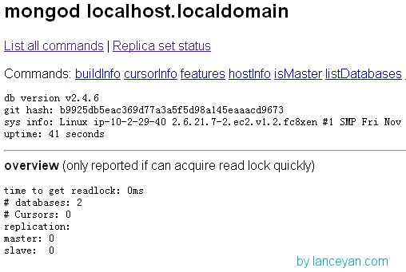
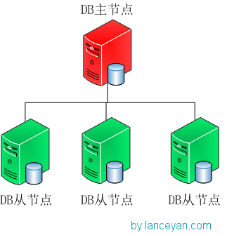

# 搭建高可用mongodb集群（一）——配置mongodb
在大数据的时代，传统的关系型数据库要能更高的服务必须要解决高并发读写、海量数据高效存储、高可扩展性和高可用性这些难题。不过就是因为这些问题Nosql诞生了。

NOSQL有这些优势：

*大数据量*，可以通过廉价服务器存储大量的数据，轻松摆脱传统mysql单表存储量级限制。

*高扩展性*，Nosql去掉了关系数据库的关系型特性，很容易横向扩展，摆脱了以往老是纵向扩展的诟病。

*高性能*，Nosql通过简单的key-value方式获取数据，非常快速。还有NoSQL的Cache是记录级的，是一种细粒度的Cache，所以NoSQL在这个层面上来说就要性能高很多。

灵活的数据模型，NoSQL无需事先为要存储的数据建立字段，随时可以存储自定义的数据格式。而在关系数据库里，增删字段是一件非常麻烦的事情。如果是非常大数据量的表，增加字段简直就是一个噩梦。

*高可用*，NoSQL在不太影响性能的情况，就可以方便的实现高可用的架构。比如mongodb通过mongos、mongo分片就可以快速配置出高可用配置。

在nosql数据库里，大部分的查询都是键值对（key、value）的方式。MongoDB是一个介于关系数据库和非关系数据库之间的产品，是非关系数据库当中最像关系数据库的。支持类似于面向对象的查询语言，几乎可以实现类似关系数据库单表查询的绝大部分功能，而且还支持对数据建立索引。所以这个非常方便，我们可以用sql操作MongoDB，从关系型数据库迁移过来，开发人员学习成本会大大减少。如果再对底层的sql API做一层封装，开发基本可以感觉不到mongodb和关系型数据库的区别。同样MongoDB也是号称自己能够快速搭建一个高可用可扩展的的分布式集群，网上有很多搭建的文章，在我们搭建的时候还需要查找修改很多东西，所以把自己实战的步骤记录下来以备忘。我们看看如何一步一步搭建这个东东。

一、mongodb单实例。这种配置只适合简易开发时使用，生产使用不行，因为单节点挂掉整个数据业务全挂，如下图。


虽然不能生产使用，但这个模式可以快速搭建启动，并且能够用mongodb的命令操作数据库。下面列出在linux下安装单节点mongodb的步骤

1. 建立mongodb测试文件夹
```
#存放整个mongodb文件
mkdir -p /data/mongodbtest/single

#存放mongodb数据文件
mkdir -p /data/mongodbtest/single/data

#进入mongodb文件夹
cd  /data/mongodbtest/single
```
2. 下载mongodb的安装程序包
```
wget http://fastdl.mongodb.org/linux/mongodb-linux-x86_64-2.4.6.tgz

#解压下载的压缩包
tar xvzf mongodb-linux-x86_64-2.4.6.tgz

#进入mongodb程序执行文件夹
cd mongodb-linux-x86_64-2.4.6/bin/
```
3. 启动单实例mongodb
```
mongod  --dbpath /data/mongodbtest/single/data
```
输出日志如下，成功！

[initandlisten] db version v2.4.6
……..
[initandlisten] waiting for connections on port 27017
[websvr] admin web console waiting for connections on port 28017

mongodb默认自带提供了web访问接口，通过 IP + 端口的形式可以访问。

http://192.168.0.1:28017/



二、主从模式。使用mysql数据库时大家广泛用到，采用双机备份后主节点挂掉了后从节点可以接替主机继续服务。所以这种模式比单节点的高可用性要好很多。


下面看一下怎么一步步搭建一个mongodb的主从复制节点：

- 1、准备两台机器 192.168.0.1 和 192.168.0.2。 192.168.0.1 当作主节点， 192.168.0.2作为从节点。
- 2、分别下载mongodb安装程序包。在192.168.0.1上建立文件夹 /data/mongodbtest/master，192.168.0.2建立文件夹/data/mongodbtest/slave。
- 3、在192.168.0.1启动mongodb主节点程序。注意后面的这个 “ –master ”参数，标示主节点。
mongod –dbpath /data/mongodbtest/master –master

输出日志如下，成功！

[initandlisten] MongoDB starting : pid=18285 port=27017 dbpath=/data/mongodbtest/master master=1
#日志显示主节点参数
[initandlisten] options: { dbpath: “/data/mongodbtest/master”, master: true }
……..
[initandlisten] waiting for connections on port 27017

4. 在192.168.0.2启动mongodb从节点程序。关键配置，指定主节点ip地址和端口 –source 192.168.0.1:27017 和 标示从节点 –source 参数。

mongod –dbpath /data/mongodbtest/slave –slave –source 192.168.0.1:27017

输出日志如下，成功！

[initandlisten] MongoDB starting : pid=17888 port=27017 dbpath=/data/mongodbtest/slave slave=1
……..
#日志显示从节点参数
[initandlisten] options: { dbpath: “/data/mongodbtest/slave”, slave: true, source: “192.168.0.1:27017” }
……..
[initandlisten] waiting for connections on port 27017
#日志显示从节点 从主节点同步复制数据
[replslave] repl: from host:192.168.0.1:27017

5. 测试主从复制。

在主节点上连接到终端：
```
mongo 127.0.0.1

#建立test 数据库。
use test;

往testdb表插入数据。
> db.testdb.insert({"test1":"testval1"})

查询testdb数据看看是否成功。
> db.testdb.find();
{ "_id" : ObjectId("5284e5cb1f4eb215b2ecc463"), "test1" : "testval1" }
```
可以看到主机的同步日志

[initandlisten] connection accepted from 192.168.0.2:37285 #3 (2 connections now open)
[slaveTracking] update local.slaves query: {_id: ObjectId(‘5284e6268ed115d6238bdb39’), config: { host: “192.168.0.2:35271”, upgradeNeeded: true }, ns: “local.oplog.$main” } update: { $set: { syncedTo: Timestamp 1384441570000|1 } } nscanned:1 nupdated:1 fastmod:1 keyUpdates:0 locks(micros) w:132015 132ms

检查从主机的数据。

mongo 127.0.0.1

查看当前数据库。
```
> show dbs;
  local   0.203125GB
  test    0.203125GB

use test;
db.testdb.find();
{ "_id" : ObjectId("5284e5cb1f4eb215b2ecc463"), "test1" : "testval1" }
```
查询后数据已经同步过来了。再看看日志，发现从主机确实从主机同步了数据。
```
Thu Nov 14 23:05:13 [replslave] repl:   checkpoint applied 15 operations
Thu Nov 14 23:05:13 [replslave] repl:   syncedTo: Nov 14 23:08:10 5284e75a:1
```
查看服务状态
```
> db.printReplicationInfo();
          this is a slave, printing slave replication info.
          source:   192.168.0.1:27017
              syncedTo: Sun Nov 17 2013 16:04:02 GMT+0800 (CST)
                      = -54 secs ago (-0.01hrs)
```
到此主从结构的mongodb搭建好了。

*故障转移测试*，现在两台服务器如果主服务器挂掉了，从服务器可以正常运转吗？

- a、先测试下从服务器可以当成主服务器吗，也就是往从服务器里写能够同步主服务器吗？
在192.168.0.2上连接mongodb。
```
mongo 127.0.0.1:27017
> db.testdb.insert({"test3":"testval3"});
not master
```
可以看到 mongodb的从节点是不能提供写操作的，只能提供读操作。

- b、如果从服务器挂掉，主服务器还可以提供服务。如果主服务器挂掉了从服务器能否自动变为可写。
测试一下！

先杀掉原来的mongodb主服务器。
```
kill -3 `ps -ef|grep mongod|grep -v grep|awk '{print $2}'`
```
测试从服务器能否可写。在192.168.0.2上连接mongodb测试。
```
> db.testdb.insert({"test3":"testval3"});
not master
```
看起来从服务器没有自动接替主服务器的功能，只有手工处理了！

停止从服务器，在原数据文件启动并添加主服务器标示。
```
mongod  --dbpath /data/mongodbtest/slave --master
```
等到启动成功（时间有点长）。在192.168.0.2 上 连接
```
mongo 192.168.0.2:27017
```
。
```
> db.testdb.find();
{ "_id" : ObjectId("5288629e9b0318be4b20bd4c"), "test1" : "testval1" }
{ "_id" : ObjectId("528862d69b0318be4b20bd4d"), "test2" : "testval2" }
```
成功！

多个从节点。现在只是一个数据库服务器又提供写又提供读，机器承载会出现瓶颈。大家还记得mysql里的读写分离吗？把20%的写放到主节点，80%的读放到从节点分摊了减少了服务器的负载。但是大部分应用都是读操作带来的压力，一个从节点压力负载不了，可以把一个从节点变成多个节点。那mongodb的一主多从可以支持吗？答案是肯定的。



为了方便测试，在192.168.0.2上再建立一个文件夹 /data/mongodbtest/slave1 作为另一个slave服务器。
启动slave2服务，
```
mongod  --dbpath /data/mongodbtest/slave1 --slave  --port 27017 --source 192.168.0.1:27017
```
成功启动后通过mongodb连接测试：
```
> db.testdb.find();
{ "_id" : ObjectId("5288629e9b0318be4b20bd4c"), "test1" : "testval1" }
{ "_id" : ObjectId("528862d69b0318be4b20bd4d"), "test2" : "testval2" }
```
搭建了这套主从复制系统是不是就很稳健了，其实不然。。。看看这几个问题？

- 主节点挂了能否自动切换连接？目前需要手工切换。
- 主节点的写压力过大如何解决？
- 从节点每个上面的数据都是对数据库全量拷贝，从节点压力会不会过大？
- 就算对从节点路由实施路由访问策略能否做到自动扩展？
还有这么多问题，有其他解决方案吗？下一篇接着弄[搭建高可用mongodb集群（二）—— 副本集](./搭建高可用mongodb集群（二）—— 副本集.md)

## 参考文档
[搭建高可用mongodb集群（一）——配置mongodb](http://www.lanceyan.com/tech/mongodb/mongodb_cluster_1.html)
