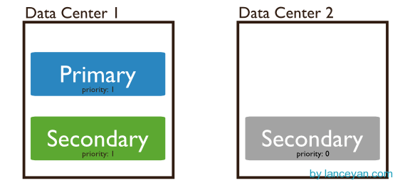
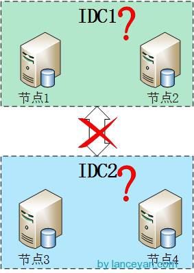

# 搭建高可用mongodb集群（三）—— 深入副本集内部机制
在上一篇文章[《搭建高可用mongodb集群（二）—— 副本集》](./搭建高可用mongodb集群（二）—— 副本集.md) 介绍了副本集的配置，这篇文章深入研究一下副本集的内部机制。还是带着副本集的问题来看吧！

副本集故障转移，主节点是如何选举的？能否手动干涉下架某一台主节点。
官方说副本集数量最好是奇数，为什么？
mongodb副本集是如何同步的？如果同步不及时会出现什么情况？会不会出现不一致性？
mongodb的故障转移会不会无故自动发生？什么条件会触发？频繁触发可能会带来系统负载加重？
*Bully算法* mongodb副本集故障转移功能得益于它的选举机制。选举机制采用了Bully算法，可以很方便从分布式节点中选出主节点。一个分布式集群架构中一般都有一个所谓的主节点，可以有很多用途，比如缓存机器节点元数据，作为集群的访问入口等等。主节点有就有吧，我们干嘛要什么Bully算法？要明白这个我们先看看这两种架构：

指定主节点的架构，这种架构一般都会申明一个节点为主节点，其他节点都是从节点，如我们常用的mysql就是这样。但是这样架构我们在第一节说了整个集群如果主节点挂掉了就得手工操作，上架一个新的主节点或者从从节点恢复数据，不太灵活。


不指定主节点，集群中的任意节点都可以成为主节点。mongodb也就是采用这种架构，一但主节点挂了其他从节点自动接替变成主节点。如下图：


好了，问题就在这个地方，既然所有节点都是一样，一但主节点挂了，怎么选择出来下一个节点是谁来做为主节点呢？这就是Bully算法解决的问题。

那什么是Bully算法，Bully算法是一种协调者（主节点）竞选算法，主要思想是集群的每个成员都可以声明它是主节点并通知其他节点。别的节点可以选择接受这个声称或是拒绝并进入主节点竞争。被其他所有节点接受的节点才能成为主节点。节点按照一些属性来判断谁应该胜出。这个属性可以是一个静态ID，也可以是更新的度量像最近一次事务ID（最新的节点会胜出）。详情请参考[NoSQL数据库分布式算法的协调者竞选](http://blog.nosqlfan.com/html/4139.html)还有[维基百科的解释](http://en.wikipedia.org/wiki/Bully_algorithm) 。

*选举* 那mongodb是怎进行选举的呢？官方这么描述:
```
We use a consensus protocol to pick a primary. Exact details will be spared here but that basic process is:

get maxLocalOpOrdinal from each server.
if a majority of servers are not up (from this server’s POV), remain in Secondary mode and stop.
if the last op time seems very old, stop and await human intervention.
else, using a consensus protocol, pick the server with the highest maxLocalOpOrdinal as the Primary.
```
大致翻译过来为使用一致协议选择主节点。基本步骤为：

1. 得到每个服务器节点的最后操作时间戳。每个mongodb都有oplog机制会记录本机的操作，方便和主服务器进行对比数据是否同步还可以用于错误恢复。
2. 如果集群中大部分服务器down机了，保留活着的节点都为 secondary状态并停止，不选举了。
3. 如果集群中选举出来的主节点或者所有从节点最后一次同步时间看起来很旧了，停止选举等待人来操作。
4. 如果上面都没有问题就选择最后操作时间戳最新（保证数据是最新的）的服务器节点作为主节点。

这里提到了一个一致协议（其实就是bully算法），这个和数据库的一致性协议还是有些区别，一致协议主要强调的是通过一些机制保证大家达成共识；而一致性协议强调的是操作的顺序一致性，比如同时读写一个数据会不会出现脏数据。一致协议在分布式里有一个经典的算法叫“Paxos算法”，后续再介绍。

上面有个问题，就是所有从节点的最后操作时间都是一样怎么办？就是谁先成为主节点的时间最快就选谁。

*选举触发条件* 选举不是什么时刻都会被触发的，有以下情况可以触发。

1. 初始化一个副本集时。
2. 副本集和主节点断开连接，可能是网络问题。
3. 主节点挂掉。
选举还有个前提条件，参与选举的节点数量必须大于副本集总节点数量的一半，如果已经小于一半了所有节点保持只读状态。
日志将会出现：
```
can't see a majority of the set, relinquishing primary
```
主节点挂掉能否人为干预？答案是肯定的。

1. 可以通过replSetStepDown命令下架主节点。这个命令可以登录主节点使用
```
db.adminCommand({replSetStepDown : 1})
```
如果杀不掉可以使用强制开关
```
db.adminCommand({replSetStepDown : 1, force : true})
```
或者使用 rs.stepDown(120)也可以达到同样的效果，中间的数字指不能在停止服务这段时间成为主节点，单位为秒。

2. 设置一个从节点有比主节点有更高的优先级。
先查看当前集群中优先级，通过rs.conf()命令，默认优先级为1是不显示的，这里标示出来。
```
rs.conf();
```
```
{
        "_id " : "rs0",
        "version" : 9,
        "members" : [
                {
                        "_id" : 0,
                        "host" : "192.168.1.136:27017"                },
                {
                        "_id" : 1,
                        "host" : "192.168.1.137:27017"                },
                {
                        "_id" : 2,
                        "host" : "192.168.1.138:27017"                }
        ]
        }
```
我们来设置，让id为1的主机可以优先成为主节点。
```
cfg = rs.conf()
cfg.members[0].priority = 1
cfg.members[1].priority = 2
cfg.members[2].priority = 1
rs.reconfig(cfg)
```
然后再执行rs.conf()命令查看优先级已经设置成功，主节点选举也会触发。
```
{
        "_id" : "rs0",
        "version" : 9,
        "members" : [
                {
                        "_id" : 0,
                        "host" : "192.168.1.136:27017"                },
                {
                        "_id" : 1,
                        "host" : "192.168.1.137:27017",
                        "priority" : 2
                },
                {
                        "_id" : 2,
                        "host" : "192.168.1.138:27017"                }
          ]
         }
```
如果不想让一个从节点成为主节点可以怎么操作？
a. 使用rs.freeze(120)冻结指定的秒数不能选举成为主节点。
b. 按照上一篇设置节点为Non-Voting类型。

3. 当主节点不能和大部分从节点通讯。把主机节点网线拔掉，嘿嘿：）

优先级还可以这么用，如果我们不想设置什么hidden节点，就用secondary类型作为备份节点也不想让他成为主节点怎么办？看下图，共三个节点分布在两个数据中心，数据中心2的节点设置优先级为0不能成为主节点，但是可以参与选举、数据复制。架构还是很灵活吧！



*奇数* 官方推荐副本集的成员数量为奇数，最多12个副本集节点，最多7个节点参与选举。最多12个副本集节点是因为没必要一份数据复制那么多份，备份太多反而增加了网络负载和拖慢了集群性能；而最多7个节点参与选举是因为内部选举机制节点数量太多就会导致1分钟内还选不出主节点，凡事只要适当就好。这个“12”、“7”数字还好，通过他们官方经过性能测试定义出来可以理解。具体还有哪些限制参考官方文档[《 MongoDB Limits and Thresholds 》](http://docs.mongodb.org/manual/reference/limits/)。 但是这里一直没搞懂整个集群为什么要奇数，通过测试集群的数量为偶数也是可以运行的，参考这个文章http://www.itpub.net/thread-1740982-1-1.html。后来突然看了一篇[stackoverflow](http://stackoverflow.com/questions/16150409/why-does-a-mongodb-replica-set-require-an-odd-number-of-voting-nodes)的文章终于顿悟了，mongodb本身设计的就是一个可以跨IDC的分布式数据库，所以我们应该把它放到大的环境来看。

假设四个节点被分成两个IDC，每个IDC各两台机器，如下图。但这样就出现了个问题，如果两个IDC网络断掉，这在广域网上很容易出现的问题，在上面选举中提到只要主节点和集群中大部分节点断开链接就会开始一轮新的选举操作，不过mongodb副本集两边都只有两个节点，但是选举要求参与的节点数量必须大于一半，这样所有集群节点都没办法参与选举，只会处于只读状态。但是如果是奇数节点就不会出现这个问题，假设3个节点，只要有2个节点活着就可以选举，5个中的3个，7个中的4个。。。




*心跳* 综上所述，整个集群需要保持一定的通信才能知道哪些节点活着哪些节点挂掉。mongodb节点会向副本集中的其他节点每两秒就会发送一次pings包，如果其他节点在10秒钟之内没有返回就标示为不能访问。每个节点内部都会维护一个状态映射表，表明当前每个节点是什么角色、日志时间戳等关键信息。如果是主节点，除了维护映射表外还需要检查自己能否和集群中内大部分节点通讯，如果不能则把自己降级为secondary只读节点。

*同步*，副本集同步分为初始化同步和keep复制。初始化同步指全量从主节点同步数据，如果主节点数据量比较大同步时间会比较长。而keep复制指初始化同步过后，节点之间的实时同步一般是增量同步。初始化同步不只是在第一次才会被处罚，有以下两种情况会触发：

1. secondary第一次加入，这个是肯定的。
2. secondary落后的数据量超过了oplog的大小，这样也会被全量复制。
那什么是oplog的大小？前面说过oplog保存了数据的操作记录，secondary复制oplog并把里面的操作在secondary执行一遍。但是oplog也是mongodb的一个集合，保存在local.oplog.rs里，但是这个oplog是一个capped collection也就是固定大小的集合，新数据加入超过集合的大小会覆盖。所以这里需要注意，跨IDC的复制要设置合适的oplogSize，避免在生产环境经常产生全量复制。oplogSize 可以通过–oplogSize设置大小，对于linux 和windows 64位，oplog size默认为剩余磁盘空间的5%。

同步也并非只能从主节点同步，假设集群中3个节点，节点1是主节点在IDC1，节点2、节点3在IDC2，初始化节点2、节点3会从节点1同步数据。后面节点2、节点3会使用就近原则从当前IDC的副本集中进行复制，只要有一个节点从IDC1的节点1复制数据。

设置同步还要注意以下几点：

1. secondary不会从delayed和hidden成员上复制数据。
2. 只要是需要同步，两个成员的buildindexes必须要相同无论是否是true和false。buildindexes主要用来设置是否这个节点的数据用于查询，默认为true。
3. 如果同步操作30秒都没有反应，则会重新选择一个节点进行同步。
到此，本章前面提到的问题全部解决了，不得不说mongodb的设计还真是强大！

后续继续解决上一节这几个问题：
1. 主节点挂了能否自动切换连接？目前需要手工切换。
2. 主节点的读写压力过大如何解决？

还有这两个问题后续解决：
1. 从节点每个上面的数据都是对数据库全量拷贝，从节点压力会不会过大？
2. 数据压力大到机器支撑不了的时候能否做到自动扩展？

下一篇接着弄[搭建高可用mongodb集群（四）—— 分片](./搭建高可用mongodb集群（四）—— 分片.md)
