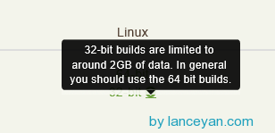
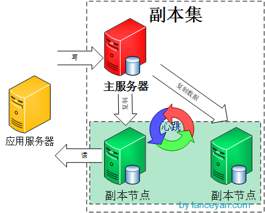
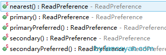
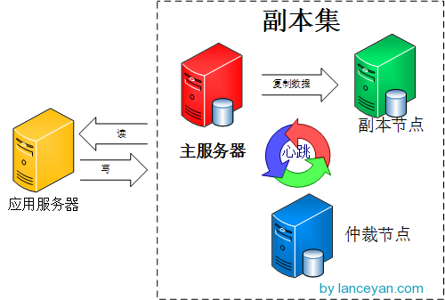

# 搭建高可用mongodb集群（二）—— 副本集

在上一篇文章[搭建高可用MongoDB集群（一）——配置MongoDB](./搭建高可用mongodb集群（一）——配置mongodb.md) 提到了几个问题还没有解决。
主节点挂了能否自动切换连接？目前需要手工切换。
主节点的读写压力过大如何解决？
从节点每个上面的数据都是对数据库全量拷贝，从节点压力会不会过大？
数据压力大到机器支撑不了的时候能否做到自动扩展？
这篇文章看完这些问题就可以搞定了。NoSQL的产生就是为了解决大数据量、高扩展性、高性能、灵活数据模型、高可用性。但是光通过主从模式的架构远远达不到上面几点，由此MongoDB设计了副本集和分片的功能。这篇文章主要介绍副本集：

mongoDB官方已经不建议使用主从模式了，替代方案是采用副本集的模式，[点击查看](./https://docs.mongodb.com/master/core/master-slave/) ，如图：


那什么是副本集呢？打魔兽世界总说打副本，其实这两个概念差不多一个意思。游戏里的副本是指玩家集中在高峰时间去一个场景打怪，会出现玩家暴多怪物少的情况，游戏开发商为了保证玩家的体验度，就为每一批玩家单独开放一个同样的空间同样的数量的怪物，这一个复制的场景就是一个副本，不管有多少个玩家各自在各自的副本里玩不会互相影响。 mongoDB的副本也是这个，主从模式其实就是一个单副本的应用，没有很好的扩展性和容错性。而副本集具有多个副本保证了容错性，就算一个副本挂掉了还有很多副本存在，并且解决了上面第一个问题“主节点挂掉了，整个集群内会自动切换”。难怪mongoDB官方推荐使用这种模式。我们来看看mongoDB副本集的架构图：


由图可以看到客户端连接到整个副本集，不关心具体哪一台机器是否挂掉。主服务器负责整个副本集的读写，副本集定期同步数据备份，一但主节点挂掉，副本节点就会选举一个新的主服务器，这一切对于应用服务器不需要关心。我们看一下主服务器挂掉后的架构：


副本集中的副本节点在主节点挂掉后通过心跳机制检测到后，就会在集群内发起主节点的选举机制，自动选举一位新的主服务器。看起来很牛X的样子，我们赶紧操作部署一下！
官方推荐的副本集机器数量为至少3个，那我们也按照这个数量配置测试。

1. 准备两台机器 192.168.1.136、192.168.1.137、192.168.1.138。 192.168.1.136 当作副本集主节点，192.168.1.137、192.168.1.138作为副本集副本节点。

2. 分别在每台机器上建立mongodb副本集测试文件夹
```
#存放整个mongodb文件
mkdir -p /data/mongodbtest/replset

#存放mongodb数据文件
mkdir -p /data/mongodbtest/replset/data

#进入mongodb文件夹
cd  /data/mongodbtest
```
3. 下载mongodb的安装程序包
```
wget http://fastdl.mongodb.org/linux/mongodb-linux-x86_64-2.4.8.tgz
```
注意linux生产环境不能安装32位的mongodb，因为32位受限于操作系统最大2G的文件限制。


```
#解压下载的压缩包
tar xvzf mongodb-linux-x86_64-2.4.8.tgz
```
4. 分别在每台机器上启动mongodb
```
/data/mongodbtest/mongodb-linux-x86_64-2.4.8/bin/mongod  --dbpath /data/mongodbtest/replset/data   --replSet repset
```
可以看到控制台上显示副本集还没有配置初始化信息。
```
Sun Dec 29 20:12:02.953 [rsStart] replSet can't get local.system.replset config from self or any seed (EMPTYCONFIG)
Sun Dec 29 20:12:02.953 [rsStart] replSet info you may need to run  replSetInitiate -- rs.initiate() in the shell -- if that is not already done
```
5. 初始化副本集

在三台机器上任意一台机器登陆mongodb
```
/data/mongodbtest/mongodb-linux-x86_64-2.4.8/bin/mongo

#使用admin数据库
use admin
```
- 定义副本集配置变量，这里的_id:”repset” 和上面命令参数“ –replSet repset” 要保持一样。
```
config = { _id:"repset", members:[
... {_id:0,host:"192.168.1.136:27017"},
... {_id:1,host:"192.168.1.137:27017"},
... {_id:2,host:"192.168.1.138:27017"}]
... }

#输出
{
        "_id" : "repset",
        "members" : [
                {
                        "_id" : 0,
                        "host" : "192.168.1.136:27017"
                },
                {
                        "_id" : 1,
                        "host" : "192.168.1.137:27017"
                },
                {
                        "_id" : 2,
                        "host" : "192.168.1.138:27017"
                }
        ]
}

#初始化副本集配置
rs.initiate(config);

#输出成功

{
        "info" : "Config now saved locally.  Should come online in about a minute.",
        "ok" : 1
}
#查看日志，副本集启动成功后，138为主节点PRIMARY，136、137为副本节点SECONDARY。

Sun Dec 29 20:26:13.842 [conn3] replSet replSetInitiate admin command received from client
Sun Dec 29 20:26:13.842 [conn3] replSet replSetInitiate config object parses ok, 3 members specified
Sun Dec 29 20:26:13.847 [conn3] replSet replSetInitiate all members seem up
Sun Dec 29 20:26:13.848 [conn3] ******
Sun Dec 29 20:26:13.848 [conn3] creating replication oplog of size: 990MB...
Sun Dec 29 20:26:13.849 [FileAllocator] allocating new datafile /data/mongodbtest/replset/data/local.1, filling with zeroes...
Sun Dec 29 20:26:13.862 [FileAllocator] done allocating datafile /data/mongodbtest/replset/data/local.1, size: 1024MB,  took 0.012 secs
Sun Dec 29 20:26:13.863 [conn3] ******
Sun Dec 29 20:26:13.863 [conn3] replSet info saving a newer config version to local.system.replset
Sun Dec 29 20:26:13.864 [conn3] replSet saveConfigLocally done
Sun Dec 29 20:26:13.864 [conn3] replSet replSetInitiate config now saved locally.  Should come online in about a minute.
Sun Dec 29 20:26:23.047 [rsStart] replSet I am 192.168.1.138:27017
Sun Dec 29 20:26:23.048 [rsStart] replSet STARTUP2
Sun Dec 29 20:26:23.049 [rsHealthPoll] replSet member 192.168.1.137:27017 is up
Sun Dec 29 20:26:23.049 [rsHealthPoll] replSet member 192.168.1.136:27017 is up
Sun Dec 29 20:26:24.051 [rsSync] replSet SECONDARY
Sun Dec 29 20:26:25.053 [rsHealthPoll] replset info 192.168.1.136:27017 thinks that we are down
Sun Dec 29 20:26:25.053 [rsHealthPoll] replSet member 192.168.1.136:27017 is now in state STARTUP2
Sun Dec 29 20:26:25.056 [rsMgr] not electing self, 192.168.1.136:27017 would veto with 'I don't think 192.168.1.138:27017 is electable'
Sun Dec 29 20:26:31.059 [rsHealthPoll] replset info 192.168.1.137:27017 thinks that we are down
Sun Dec 29 20:26:31.059 [rsHealthPoll] replSet member 192.168.1.137:27017 is now in state STARTUP2
Sun Dec 29 20:26:31.062 [rsMgr] not electing self, 192.168.1.137:27017 would veto with 'I don't think 192.168.1.138:27017 is electable'
Sun Dec 29 20:26:37.074 [rsMgr] replSet info electSelf 2
Sun Dec 29 20:26:38.062 [rsMgr] replSet PRIMARY
Sun Dec 29 20:26:39.071 [rsHealthPoll] replSet member 192.168.1.137:27017 is now in state RECOVERING
Sun Dec 29 20:26:39.075 [rsHealthPoll] replSet member 192.168.1.136:27017 is now in state RECOVERING
Sun Dec 29 20:26:42.201 [slaveTracking] build index local.slaves { _id: 1 }
Sun Dec 29 20:26:42.207 [slaveTracking] build index done.  scanned 0 total records. 0.005 secs
Sun Dec 29 20:26:43.079 [rsHealthPoll] replSet member 192.168.1.136:27017 is now in state SECONDARY
Sun Dec 29 20:26:49.080 [rsHealthPoll] replSet member 192.168.1.137:27017 is now in state SECONDARY

#查看集群节点的状态
 rs.status();
#输出

{
        "set" : "repset",
        "date" : ISODate("2013-12-29T12:54:25Z"),
        "myState" : 1,
        "members" : [
                {
                        "_id" : 0,
                        "name" : "192.168.1.136:27017",
                        "health" : 1,
                        "state" : 2,
                        "stateStr" : "SECONDARY",
                        "uptime" : 1682,
                        "optime" : Timestamp(1388319973, 1),
                        "optimeDate" : ISODate("2013-12-29T12:26:13Z"),
                        "lastHeartbeat" : ISODate("2013-12-29T12:54:25Z"),
                        "lastHeartbeatRecv" : ISODate("2013-12-29T12:54:24Z"),
                        "pingMs" : 1,
                        "syncingTo" : "192.168.1.138:27017"
                },
                {
                        "_id" : 1,
                        "name" : "192.168.1.137:27017",
                        "health" : 1,
                        "state" : 2,
                        "stateStr" : "SECONDARY",
                        "uptime" : 1682,
                        "optime" : Timestamp(1388319973, 1),
                        "optimeDate" : ISODate("2013-12-29T12:26:13Z"),
                        "lastHeartbeat" : ISODate("2013-12-29T12:54:25Z"),
                        "lastHeartbeatRecv" : ISODate("2013-12-29T12:54:24Z"),
                        "pingMs" : 1,
                        "syncingTo" : "192.168.1.138:27017"
                },
                {
                        "_id" : 2,
                        "name" : "192.168.1.138:27017",
                        "health" : 1,
                        "state" : 1,
                        "stateStr" : "PRIMARY",
                        "uptime" : 2543,
                        "optime" : Timestamp(1388319973, 1),
                        "optimeDate" : ISODate("2013-12-29T12:26:13Z"),
                        "self" : true
                }
        ],
        "ok" : 1
}
```
整个副本集已经搭建成功了。

6. 测试副本集数据复制功能
```
#在主节点192.168.1.138 上连接到终端：
mongo 127.0.0.1

#建立test 数据库。
use test;

往testdb表插入数据。
> db.testdb.insert({"test1":"testval1"})

#在副本节点 192.168.1.136、192.168.1.137 上连接到mongodb查看数据是否复制过来。
/data/mongodbtest/mongodb-linux-x86_64-2.4.8/bin/mongo 192.168.1.136:27017

#使用test 数据库。
repset:SECONDARY> use test;

repset:SECONDARY> show tables;
#输出

Sun Dec 29 21:50:48.590 error: { "$err" : "not master and slaveOk=false", "code" : 13435 } at src/mongo/shell/query.js:128

#mongodb默认是从主节点读写数据的，副本节点上不允许读，需要设置副本节点可以读。
repset:SECONDARY> db.getMongo().setSlaveOk();

#可以看到数据已经复制到了副本集。
repset:SECONDARY> db.testdb.find();

#输出
{ "_id" : ObjectId("52c028460c7505626a93944f"), "test1" : "testval1" }
```
7. 测试副本集故障转移功能

先停掉主节点mongodb 138，查看136、137的日志可以看到经过一系列的投票选择操作，137 当选主节点，136从137同步数据过来。
```
Sun Dec 29 22:03:05.351 [rsBackgroundSync] replSet sync source problem: 10278 dbclient error communicating with server: 192.168.1.138:27017
Sun Dec 29 22:03:05.354 [rsBackgroundSync] replSet syncing to: 192.168.1.138:27017
Sun Dec 29 22:03:05.356 [rsBackgroundSync] repl: couldn't connect to server 192.168.1.138:27017
Sun Dec 29 22:03:05.356 [rsBackgroundSync] replSet not trying to sync from 192.168.1.138:27017, it is vetoed for 10 more seconds
Sun Dec 29 22:03:05.499 [rsHealthPoll] DBClientCursor::init call() failed
Sun Dec 29 22:03:05.499 [rsHealthPoll] replset info 192.168.1.138:27017 heartbeat failed, retrying
Sun Dec 29 22:03:05.501 [rsHealthPoll] replSet info 192.168.1.138:27017 is down (or slow to respond):
Sun Dec 29 22:03:05.501 [rsHealthPoll] replSet member 192.168.1.138:27017 is now in state DOWN
Sun Dec 29 22:03:05.511 [rsMgr] not electing self, 192.168.1.137:27017 would veto with '192.168.1.136:27017 is trying to elect itself but 192.168.1.138:27017 is already primary and more up-to-date'
Sun Dec 29 22:03:07.330 [conn393] replSet info voting yea for 192.168.1.137:27017 (1)
Sun Dec 29 22:03:07.503 [rsHealthPoll] replset info 192.168.1.138:27017 heartbeat failed, retrying
Sun Dec 29 22:03:08.462 [rsHealthPoll] replSet member 192.168.1.137:27017 is now in state PRIMARY
Sun Dec 29 22:03:09.359 [rsBackgroundSync] replSet syncing to: 192.168.1.137:27017
Sun Dec 29 22:03:09.507 [rsHealthPoll] replset info 192.168.1.138:27017 heartbeat failed, retrying
```
查看整个集群的状态，可以看到138为状态不可达。
```
/data/mongodbtest/mongodb-linux-x86_64-2.4.8/bin/mongo 192.168.1.136:27017

repset:SECONDARY> rs.status();
#输出

{
        "set" : "repset",
        "date" : ISODate("2013-12-29T14:28:35Z"),
        "myState" : 2,
        "syncingTo" : "192.168.1.137:27017",
        "members" : [
                {
                        "_id" : 0,
                        "name" : "192.168.1.136:27017",
                        "health" : 1,
                        "state" : 2,
                        "stateStr" : "SECONDARY",
                        "uptime" : 9072,
                        "optime" : Timestamp(1388324934, 1),
                        "optimeDate" : ISODate("2013-12-29T13:48:54Z"),
                        "self" : true
                },
                {
                        "_id" : 1,
                        "name" : "192.168.1.137:27017",
                        "health" : 1,
                        "state" : 1,
                        "stateStr" : "PRIMARY",
                        "uptime" : 7329,
                        "optime" : Timestamp(1388324934, 1),
                        "optimeDate" : ISODate("2013-12-29T13:48:54Z"),
                        "lastHeartbeat" : ISODate("2013-12-29T14:28:34Z"),
                        "lastHeartbeatRecv" : ISODate("2013-12-29T14:28:34Z"),
                        "pingMs" : 1,
                        "syncingTo" : "192.168.1.138:27017"
                },
                {
                        "_id" : 2,
                        "name" : "192.168.1.138:27017",
                        "health" : 0,
                        "state" : 8,
                        "stateStr" : "(not reachable/healthy)",
                        "uptime" : 0,
                        "optime" : Timestamp(1388324934, 1),
                        "optimeDate" : ISODate("2013-12-29T13:48:54Z"),
                        "lastHeartbeat" : ISODate("2013-12-29T14:28:35Z"),
                        "lastHeartbeatRecv" : ISODate("2013-12-29T14:28:23Z"),
                        "pingMs" : 0,
                        "syncingTo" : "192.168.1.137:27017"
                }
        ],
        "ok" : 1
}
```
再启动原来的主节点 138，发现138 变为 SECONDARY，还是137 为主节点 PRIMARY。
```
Sun Dec 29 22:21:06.619 [rsStart] replSet I am 192.168.1.138:27017
Sun Dec 29 22:21:06.619 [rsStart] replSet STARTUP2
Sun Dec 29 22:21:06.627 [rsHealthPoll] replset info 192.168.1.136:27017 thinks that we are down
Sun Dec 29 22:21:06.627 [rsHealthPoll] replSet member 192.168.1.136:27017 is up
Sun Dec 29 22:21:06.627 [rsHealthPoll] replSet member 192.168.1.136:27017 is now in state SECONDARY
Sun Dec 29 22:21:07.628 [rsSync] replSet SECONDARY
Sun Dec 29 22:21:08.623 [rsHealthPoll] replSet member 192.168.1.137:27017 is up
Sun Dec 29 22:21:08.624 [rsHealthPoll] replSet member 192.168.1.137:27017 is now in state PRIMARY
```
8. java程序连接副本集测试。三个节点有一个节点挂掉也不会影响应用程序客户端对整个副本集的读写！
```
public class TestMongoDBReplSet {

        public static void main(String[] args) {

               try {
                     List<ServerAddress> addresses = new ArrayList<ServerAddress>();
                     ServerAddress address1 = new ServerAddress("192.168.1.136" , 27017);
                     ServerAddress address2 = new ServerAddress("192.168.1.137" , 27017);
                     ServerAddress address3 = new ServerAddress("192.168.1.138" , 27017);
                     addresses.add(address1);
                     addresses.add(address2);
                     addresses.add(address3);

                     MongoClient client = new MongoClient(addresses);
                     DB db = client.getDB( "test");
                     DBCollection coll = db.getCollection( "testdb");

                      // 插入
                     BasicDBObject object = new BasicDBObject();
                     object.append( "test2", "testval2" );

                     coll.insert(object);

                     DBCursor dbCursor = coll.find();

                      while (dbCursor.hasNext()) {
                           DBObject dbObject = dbCursor.next();
                           System. out.println(dbObject.toString());
                     }

              } catch (Exception e) {
                     e.printStackTrace();
              }

       }

}
```
目前看起来支持完美的故障转移了，这个架构是不是比较完美了？其实还有很多地方可以优化，比如开头的第二个问题：主节点的读写压力过大如何解决？常见的解决方案是读写分离，mongodb副本集的读写分离如何做呢？

看图说话：



常规写操作来说并没有读操作多，所以一台主节点负责写，两台副本节点负责读。

1. 设置读写分离需要先在副本节点SECONDARY 设置 setSlaveOk。
2. 在程序中设置副本节点负责读操作，如下代码：
```
public class TestMongoDBReplSetReadSplit {

        public static void main(String[] args) {

               try {
                     List<ServerAddress> addresses = new ArrayList<ServerAddress>();
                     ServerAddress address1 = new ServerAddress("192.168.1.136" , 27017);
                     ServerAddress address2 = new ServerAddress("192.168.1.137" , 27017);
                     ServerAddress address3 = new ServerAddress("192.168.1.138" , 27017);
                     addresses.add(address1);
                     addresses.add(address2);
                     addresses.add(address3);

                     MongoClient client = new MongoClient(addresses);
                     DB db = client.getDB( "test" );
                     DBCollection coll = db.getCollection( "testdb" );


                     BasicDBObject object = new BasicDBObject();
                     object.append( "test2" , "testval2" );

                      //读操作从副本节点读取
                     ReadPreference preference = ReadPreference. secondary();
                     DBObject dbObject = coll.findOne(object, null , preference);

                     System. out .println(dbObject);


              } catch (Exception e) {
                     e.printStackTrace();
              }
       }
}
```
读参数除了secondary一共还有五个参数：primary、primaryPreferred、secondary、secondaryPreferred、nearest。



*primary*:默认参数，只从主节点上进行读取操作；
*primaryPreferred*:大部分从主节点上读取数据,只有主节点不可用时从secondary节点读取数据。
*secondary*:只从secondary节点上进行读取操作，存在的问题是secondary节点的数据会比primary节点数据“旧”。
*secondaryPreferred*:优先从secondary节点进行读取操作，secondary节点不可用时从主节点读取数据；
*nearest*:不管是主节点、secondary节点，从网络延迟最低的节点上读取数据。

好，读写分离做好我们可以数据分流，减轻压力解决了“主节点的读写压力过大如何解决？”这个问题。不过当我们的副本节点增多时，主节点的复制压力会加大有什么办法解决吗？mongodb早就有了相应的解决方案。

看图：


其中的仲裁节点不存储数据，只是负责故障转移的群体投票，这样就少了数据复制的压力。是不是想得很周到啊，一看mongodb的开发兄弟熟知大数据架构体系，其实不只是主节点、副本节点、仲裁节点，还有Secondary-Only、Hidden、Delayed、Non-Voting。

*Secondary-Only*:不能成为primary节点，只能作为secondary副本节点，防止一些性能不高的节点成为主节点。
*Hidden*:这类节点是不能够被客户端制定IP引用，也不能被设置为主节点，但是可以投票，一般用于备份数据。
*Delayed*：可以指定一个时间延迟从primary节点同步数据。主要用于备份数据，如果实时同步，误删除数据马上同步到从节点，恢复又恢复不了。
*Non-Voting*：没有选举权的secondary节点，纯粹的备份数据节点。

到此整个mongodb副本集搞定了两个问题：

- 主节点挂了能否自动切换连接？目前需要手工切换。
- 主节点的读写压力过大如何解决？

还有这两个问题后续解决：
- 从节点每个上面的数据都是对数据库全量拷贝，从节点压力会不会过大？
- 数据压力大到机器支撑不了的时候能否做到自动扩展？

做了副本集发现又一些问题：
- 副本集故障转移，主节点是如何选举的？能否手动干涉下架某一台主节点。
- 官方说副本集数量最好是奇数，为什么？
- mongodb副本集是如何同步的？如果同步不及时会出现什么情况？会不会出现不一致性？
- mongodb的故障转移会不会无故自动发生？什么条件会触发？频繁触发可能会带来系统负载加重

下一篇接着弄[搭建高可用mongodb集群（三）—— 深入副本集内部机制](./搭建高可用mongodb集群（三）—— 深入副本集内部机制.md)
参考：

http://cn.docs.mongodb.org/manual/administration/replica-set-member-configuration/
http://docs.mongodb.org/manual/reference/connection-string/
http://www.cnblogs.com/magialmoon/p/3268963.html
