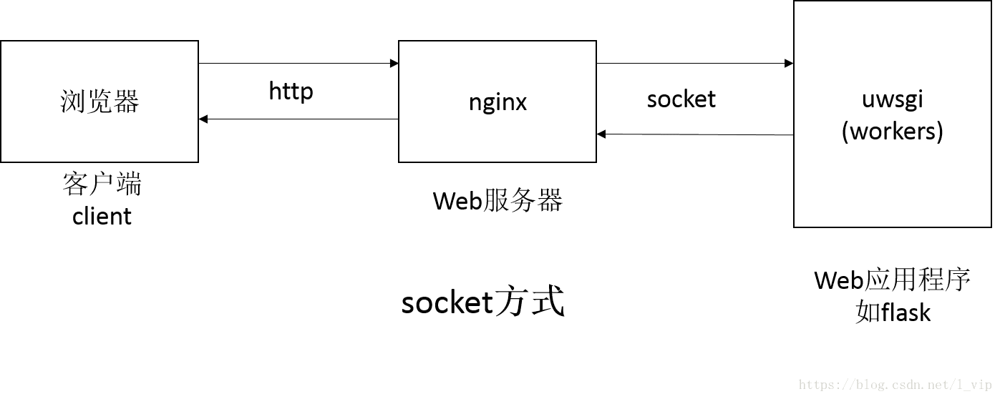
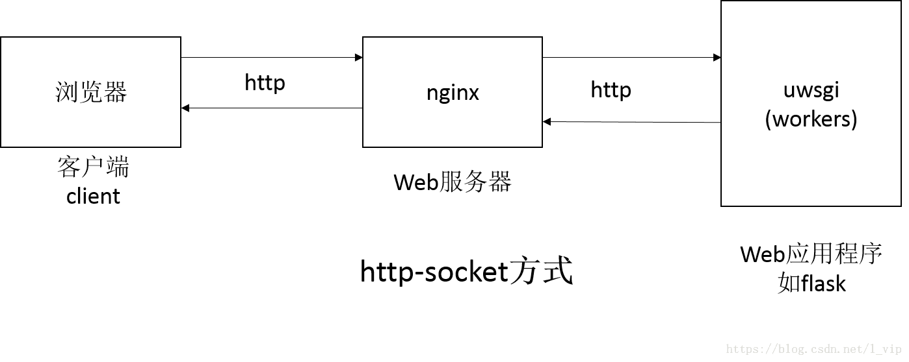
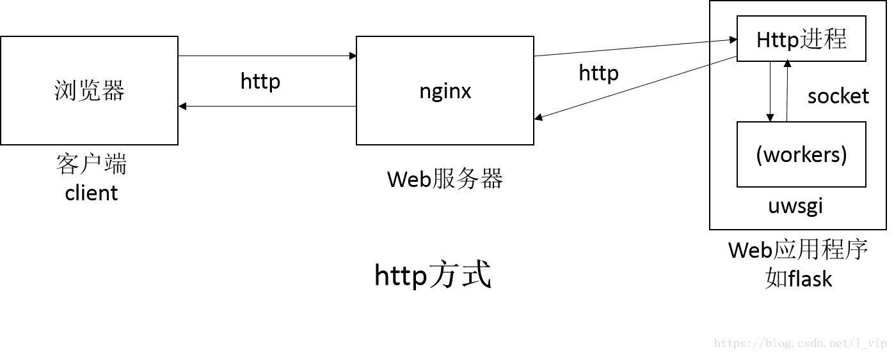
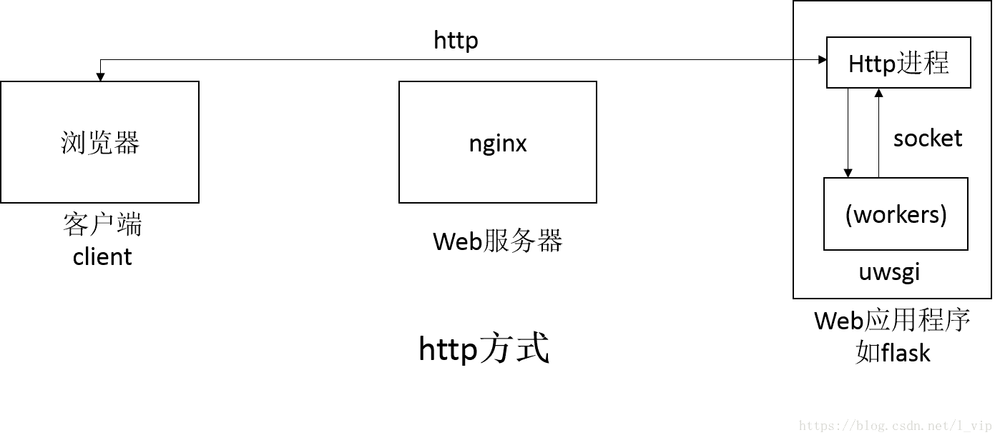

# uwsgi配置理解
## 一、http/http-socket/socket

uwsgi开头当然少不了通信的接口。
有3种方式：
```
socket=127.0.0.1:8888
http=0.0.0.0:8888
http-socket=127.0.0.1:8888
```

 三个方式看起来十分的相似，阅读了很多博客和官方文档，下面是自己的一些理解（可能不完全正确）！




图一是socket方式，现在大部分web服务器（如nginx）支持uwsgi， 这是这三种方式最高效的一种形式，socket通信速度会比http快

图二是http-socket方式，这个适用于web服务器不支持uwsgi时。

后面2个图都是http方式，使用http启动uwsgi，系统会额外启动一个http进程，从级别上来说，它和nginx是同一级别的，所以客户端和uwsgi通信，完全可以绕过nginx，不需要额外进行一个转发（如图三一样），但很显然，这是并不是一个很明智但选择，这样会失去了nginx很多优秀的功能。

官方推荐的方式为socket以及http-socket方式，显然使用http方式会额外产生一个http进程，如果还通过nginx转发，那么效率上来说是相对比较低的。

## 二、processes/workers.

表示开启多进程，根据你的应有开启合适的进程数，在一些参考资料上，可能会看到processes = 2 * cpucores或者workers = 2 * cpucores，如果应有比较简单，这样设置一般可以。如果想更合理，官方提供了uwsgitop去获得一个较为合理的值。

## 三、threads & enable-threads

python中存在GIL，实际上不存在真正意义上的多线程，但是否需要，这个就根据各自但需求设定了。结合processes:
```
processes=2
threads=4
```
表示2个进程，每个进程中有4个线程。

由于GIL的存在，uwsgi索性默认不支持多线程，不对GIL进行初始化。但如果希望程序中的线程发挥作用，需要加入enable-threads=True；

但如果已经在多线程模式（使用 threads 选项）下，那么uWSGI将会自动启用线程支持。

## 四、uid & gid & chmod-socket

uwsgi不建议使用root权限去启动uwsgi实例。可以通过root用户去运行uwsgi文件，当通过uid和gid去修改用户（移除root权限）。并且，如果你使用的是socket的通信方式，最好加上chmod-socket字段，在linux下，socket的启动方式，套接字类似文件，你必须保证有权限去读取它。
```
chmod-socket=660
uid=1000
gid=1000
```
## 五、master

意味着启动一个master主进程来管理其他进程，建议启动这个进程，在管理的时候比较方便；如果kill这个master进程，相当于关闭所有的uwsgi进程。

## 六、其他

chdir: 工程目录（启动文件所在位置）。 
module: 应有程序文件（这个字段与wsgi-file相似？）
callable：flask应用实例的名称，是flask独有的配置项（django不需要）。由于flask存在特殊的机制，可以实例化多个application，需要明确指出，收到请求时，uwsgi应该调用哪个应用实例。
buffer-size: 设置用于uwsgi包解析的内部缓存区大小，默认是4k。如果你允许接受较大数据的报头，这个值可以设置到64k，如果出现报头过大的错误，可以通过设置这个值解决。
daemonize: 日志输出文件。
disable-logging: 不记录正常的请求日志，只记录错误日志。

## 七、lazy-app

这个字段有着特殊的作用，目前还在测试与使用，接下来再把发现的问题更新进来。

下面是是我flask项目的完整uwsgi文件：
```
socket=127.0.0.1:9088
#http-socket=127.0.0.1:8888
#http=127.0.0.1:8888

processes=2
threads=4
enable-threads=true
lazy-apps=true

uid=1000
gid=1000
chmod-socket=660

master=true
chdir=/data/myapp/
module=manage
callable=app

buffer-size=65536
daemonize=/data/log/uwsgi/app.log
```
### 参考文档
[uwsgi配置理解](https://blog.csdn.net/l_vip/article/details/81487608)
